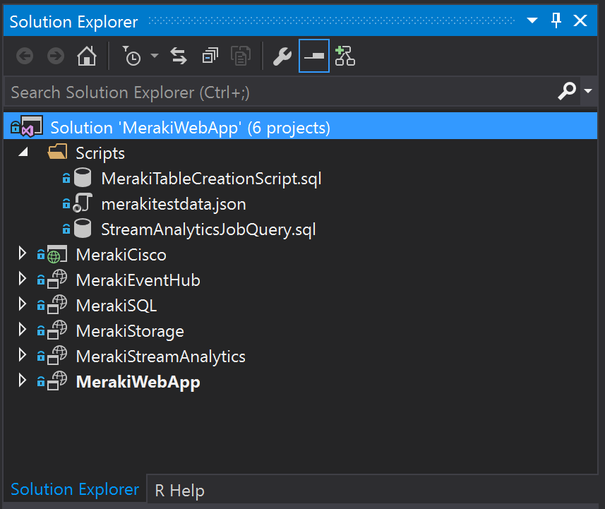

# Cisco Meraki Location Analytics
Azure PaaS Implementation using Lambda Architecture of Cisco Meraki In-Store Location Analytics

## **Note:**
> This solution is not production ready as it requires security hardening and relevant scaling based on specific customer environments. 

## Use Case

This solution is a quick demonstration of the art of possible for any smart buildings, retail stores, universities, hospitals equipped with WAPs (Wireless Access Points) using Azure PaaS offering. It enables data ingestion omitted through user mobile devices into Azure Cloud via Meraki Cloud API for analytical purposes i.e. 

- Foot-Fall Analysis
- Staff Optimisation
- Store Layout Optimisation 
- Product Recommendation
- Many other advance use cases

Along the way you will also be exposed to a number of other Azure components, namely Event Hub, Stream Analytics, and Power BI. When everything is successfully deployed and running, the final result will be a PowerBI dashboard showing the following Line chart for real time footfall captured via user mobile devices and further Dashboard visualisations can be added after batch aggregation / analysis.

> **Note:** This solution is pre-configured with the Cisco Meraki settings but can be very easily tailored for other manufacturers. 

## Requirements

- Microsoft <a href="https://azure.microsoft.com/en-us/">Azure</a> subscription with login credentials
- <a href="https://powerbi.microsoft.com/">PowerBI</a> subscription with login credentials
- A local installation of <a href="https://azure.microsoft.com/en-us/documentation/articles/sql-data-warehouse-install-visual-studio/">Visual Studio 2015 with SQL Server Data Tools (SSDT)</a>
- Azure SDK
- Nuget Package installtion of "WindowsAzure.ServiceBus" & "WindowsAzure.Storage" from within Visual Studio 2015 -->Project-->Manage NuGet Packages menu option

# High Level Architecture

## Deploy

Below are the steps to deploy the use case into your Azure subscription.

**Clone or download the code from Github repositry and open the solution file in Visual Studio 2015. It will look like the following:**

> **Note:** Deploy the Azure Components in the following order.

## Azure Blob Storage
https://docs.microsoft.com/en-us/azure/storage/storage-introduction#blob-storage

1. Parameters
   1. Right-Click on MerakiStorage Project in Solution Explorer 
   1. Change: LOCATION: **[*LOCATION*]** (The region where everything will be deployed) and Other properties as needed
   1. Click: Edit Paramters (If you need to change default values)
   1. Click: **OK**

## Azure SQL (This setup is for Batch Analytics / Processing)
https://docs.microsoft.com/en-us/azure/storage/storage-introduction#blob-storage

1. Parameters
   1. Right-Click on MerakiSQL Project in Solution Explorer 
   1. Change: LOCATION: **[*LOCATION*]** (The region where everything will be deployed) and Other properties as needed
   1. Click: Edit Paramters (If you need to change default values)
   1. Click: **OK**

Next you need to create the matching tables in the SQL Data Warehouse. You can do this by following these steps:

1. Start Visual Studio. Note that you must have installed the SQL Server Data Tools.
1. Select: View: **SQL Server Object Explorer**
1. Right click: **SQL Server**
1. Click: **Add SQL Server...**
1. Type: Server Name: **merakiservertest.database.windows.net**
1. Select: Authentication: **Sql Server Authentication**
1. Type: User name: **CiscoTest**
1. Type: Password: **Meraki121121#**
1. Select: Database Name: **merakidb**
1. Click: **Connect**
1. Right click: **merakidb**
1. Select: **New Query...**
1. Copy and paste:

CREATE TABLE [dbo].[tblMeraki] (
    [Id]           INT          IDENTITY (1, 1) NOT NULL,
    [Version]      VARCHAR (5)  NULL,
    [Secret]       VARCHAR (50) NULL,
    [Type]         VARCHAR (20) NULL,
    [apFloors]     VARCHAR (50) NULL,
    [apTags]       VARCHAR (50) NULL,
    [apMac]        VARCHAR (50) NULL,
    [manufacturer] VARCHAR (50) NULL,
    [lng]          DECIMAL (18) NULL,
    [lat]          DECIMAL (18) NULL,
    [x]            DECIMAL (18) NULL,
    [y]            DECIMAL (18) NULL,
    [unc]          DECIMAL (18) NULL,
    [seentime]     DATETIME     NULL,
    [ssid]         VARCHAR (50) NULL,
    [os]           CHAR (10)    NULL,
    [clientMac]    VARCHAR (50) NULL,
    [seenEpoch]    VARCHAR (50) NULL,
    [rssi]         VARCHAR (50) NULL,
    PRIMARY KEY CLUSTERED ([Id] ASC)
);

GO

1. Click: **Execute**

## Azure Event Hubs 
https://docs.microsoft.com/en-us/azure/event-hubs/event-hubs-what-is-event-hubs

This is currently created with 1 Throughput Unit.

1. Parameters
   1. Right-Click on MerakiEventHub Project in Solution Explorer 
   1. Change: LOCATION: **[*LOCATION*]** (The region where everything will be deployed) and Other properties as needed
   1. Click: Edit Paramters (If you need to change default values)
   1. Click: **OK**

## Azure Stream Analytics
https://docs.microsoft.com/en-us/azure/stream-analytics/stream-analytics-introduction

1. Parameters
   1. Right-Click on MerakiStreamAnalytics Project in Solution Explorer 
   1. Change: LOCATION: **[*LOCATION*]** (The region where everything will be deployed) and Other properties as needed
   1. Click: Edit Paramters (If you need to change default values)
   1. Click: **OK**

## TODOs
- Use Https for communication between Meraki API and Web APP Endpoint (Currently going through a process to get it implemneted with the help of Cisco)
- Streamline script outputs
- Add error handling
- Automate Stream Analytics Input/Output and Query sections

