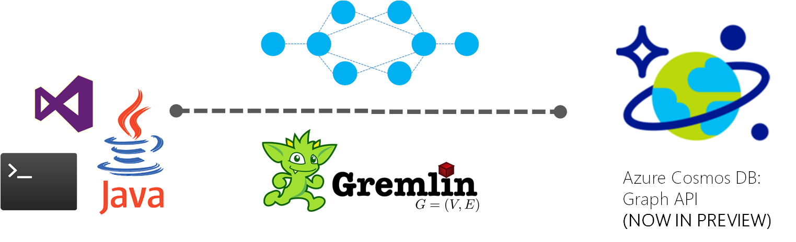

# Getting started with Azure Cosmos DB: Graph API
[Azure Cosmos DB](http://cosmosdb.com) is a globally distributed, multi-model database for mission critical applications. Azure Cosmos DB provides the [Graph API](https://docs.microsoft.com/azure/cosmosdb/graph-introduction.md) for applications that need to model, query, and traverse large graphs efficiently using the [Gremlin standard](http://tinkerpop.apache.org/docs/current/reference/#graph-traversal-steps). Azure Cosmos DB's graph API is currently in public preview.

## About this sample: CRUD and Query using Gremlin in .NET

 

Azure Cosmos DB also provides first-party .NET and .NET Core libraries via Nuget that provide Gremlin extension methods on top of the Azure Cosmos DB SDKs. These libraries provide an "in-proc" Gremlin server that can be used to connect directly to Azure Cosmos DB data partitions.
This sample shows how to setup your development environment with Azure Cosmos DB graph APIs, create a graph, adding, updating, and removing vertices and edges from the graph, and performing queries and traversals using Gremlin.

* Open in Visual Studio
* Update the settings to Azure Cosmos DB account endpoint and keys in `App.config`, i.e. `<add key="Endpoint" value="https://FILLME.documents.azure.com:443/"/>` and `<add key="AuthKey" value="FILLME"/>`
* Run the application

We provide a walkthrough of the sample at [Get started with Azure Cosmos DB's Graph API using .NET](https://docs.microsoft.com/azure/cosmosdb/create-graph-dotnet.md)

```cs
// Azure Cosmos DB supports the Gremlin API for working with Graphs. Gremlin is a functional programming language composed of steps.
// Here, we run a series of Gremlin queries to show how you can add vertices, edges, modify properties, perform queries and traversals
// For additional details, see https://aka.ms/gremlin for the complete list of supported Gremlin operators
Dictionary<string, string> gremlinQueries = new Dictionary<string, string>
{
    { "Cleanup",        "g.V().drop()" },
    { "AddVertex 1",    "g.addV('person').property('id', 'thomas').property('firstName', 'Thomas').property('age', 44)" },
    { "AddVertex 2",    "g.addV('person').property('id', 'mary').property('firstName', 'Mary').property('lastName', 'Andersen').property('age', 39)" },
    { "AddVertex 3",    "g.addV('person').property('id', 'ben').property('firstName', 'Ben').property('lastName', 'Miller')" },
    { "AddVertex 4",    "g.addV('person').property('id', 'robin').property('firstName', 'Robin').property('lastName', 'Wakefield')" },
    { "AddEdge 1",      "g.V('thomas').addE('knows').to(g.V('mary'))" },
    { "AddEdge 2",      "g.V('thomas').addE('knows').to(g.V('ben'))" },
    { "AddEdge 3",      "g.V('ben').addE('knows').to(g.V('robin'))" },
    { "UpdateVertex",   "g.V('thomas').property('age', 44)" },
    { "CountVertices",  "g.V().count()" },
    { "Filter Range",   "g.V().hasLabel('person').has('age', gt(40))" },
    { "Project",        "g.V().hasLabel('person').values('firstName')" },
    { "Sort",           "g.V().hasLabel('person').order().by('firstName', decr)" },
    { "Traverse",       "g.V('thomas').outE('knows').inV().hasLabel('person')" },
    { "Traverse 2x",    "g.V('thomas').outE('knows').inV().hasLabel('person').outE('knows').inV().hasLabel('person')" },
    { "Loop",           "g.V('thomas').repeat(out()).until(has('id', 'robin')).path()" },
    { "DropEdge",       "g.V('thomas').outE('knows').where(inV().has('id', 'mary')).drop()" },
    { "CountEdges",     "g.E().count()" },
    { "DropVertex",     "g.V('thomas').drop()" },
};

foreach (KeyValuePair<string, string> gremlinQuery in gremlinQueries)
{
    Console.WriteLine($"Running {gremlinQuery.Key}: {gremlinQuery.Value}");

    // The CreateGremlinQuery method extensions allow you to execute Gremlin queries and iterate
    // results asychronously
    IDocumentQuery<dynamic> query = client.CreateGremlinQuery<dynamic>(graph, gremlinQuery.Value);
    while (query.HasMoreResults)
    {
        foreach (dynamic result in await query.ExecuteNextAsync())
        {
            Console.WriteLine($"\t {JsonConvert.SerializeObject(result)}");
        }
    }

    Console.WriteLine();
}
```

## Graph database support overview
[Azure Cosmos DB](http://cosmosdb.com) provides you with a fully-managed graph database service with global distribution, elastic scaling of storage and throughput, automatic indexing and query, tunable consistency levels, and supports the Gremlin standard. It also provides the ability to use multiple models like document and graph over the same data. For example, you can use a document collection to store graph data side by side with documents, and use both SQL queries over JSON and Gremlin queries to query the collection.


